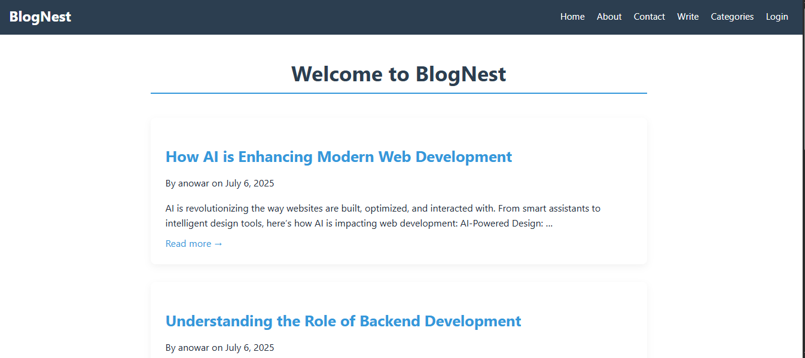
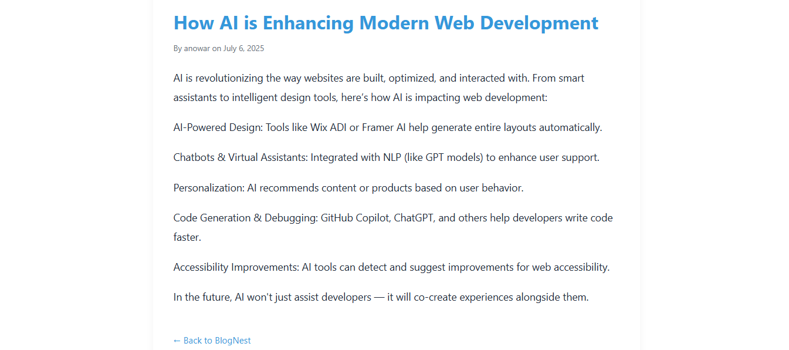
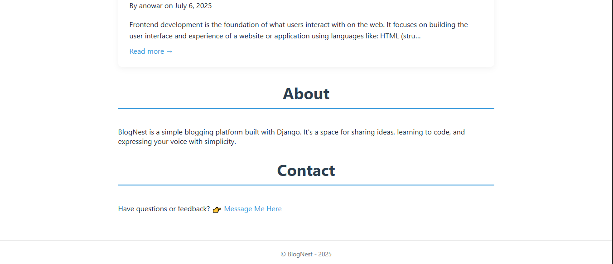

# BlogNest
A simple, clean, and responsive Django blog platform featuring categories, user registration/login, and an About & Contact footer section.

## Features
- User registration and login/logout functionality  
- Display blog posts with category filtering  
- Responsive navbar with BlogNest branding and hamburger menu for mobile  
- About and Contact information in the footer  
- Mobile-friendly and clean UI design  

## Technologies Used

- Python 3.13+  
- Django 5.0.6  
- HTML5, CSS3 (custom styles)  
- Django Templates  

## Installation and Setup

1. Clone the repository:

   git clone https://github.com/AnowarOHossain/BlogNest.git

   cd BlogNest

2. Create and activate a virtual environment:

   python -m venv venv
   # Windows
   venv\Scripts\activate
   # macOS/Linux
   source venv/bin/activate

3. Install Django (if not installed):

   python -m pip install django

4. Run migrations:

   python manage.py makemigrations
   python manage.py migrate

5. (Optional) Create superuser for admin panel access:

   python manage.py createsuperuser

6. Run the development server:

   python manage.py runserver

7. Open your browser and visit:

   * **Homepage:** [http://127.0.0.1:8000/](http://127.0.0.1:8000/)
   * **Admin login:** [http://127.0.0.1:8000/admin/](http://127.0.0.1:8000/admin/)

## Note for Students and Learners

This project is free to clone, fork, and use for learning and educational purposes. Feel free to explore, modify, and enhance it as part of your development journey.

## Project Folder Structure

BlogNest/
├── blog_project/                  # Main Django project folder  
│   ├── __init__.py  
│   ├── asgi.py  
│   ├── settings.py                # Project settings including INSTALLED_APPS, TEMPLATES, DATABASES  
│   ├── urls.py                   # Root URL configurations including blog app URLs  
│   └── wsgi.py  
│  
├── blog/                         # Django app for blog functionality  
│   ├── templates/                # HTML templates  
│   │   └── blog/  
│   │       ├── home.html         # Homepage listing posts and categories  
│   │       ├── post_detail.html  # Individual blog post detail  
│   ├── __init__.py  
│   ├── admin.py                  # Django admin configurations for models  
│   ├── apps.py  
│   ├── models.py                # Blog and Category models  
│   ├── tests.py  
│   ├── urls.py                  # App URL patterns (home, post detail, category, register)  
│   └── views.py                 # Views handling requests and rendering templates  
├── static/                   # Static files (CSS, JS, images)  
│   │   └── style.css             # Custom CSS including responsive navbar and footer styles  
├── db.sqlite3                   # Default SQLite database (after migrations)  
├── manage.py                    # Django project management script  
└── README.md                    # This documentation file  

## 📸 Screenshots

Here are some previews of BlogNest in action:

### 🖥️ Homepage

### 📄 Post Detail Page

### 🔐 Login Page

## Usage

* Visit the homepage to browse posts
* Click on categories to filter posts by category
* Register or login to the site for personalized features
* Use the navbar to navigate easily
* Access admin interface at `/admin/` (requires superuser)
* Find About and Contact info in the footer
* Responsive design works well on mobile devices

## Contact

Created by **Anowar Hossain**
GitHub: [Anowar Hossain](https://github.com/AnowarOHossain)  
To Message me: [Click Here](https://msganowar.netlify.app/)

## License

This project is open-source under the MIT License.

